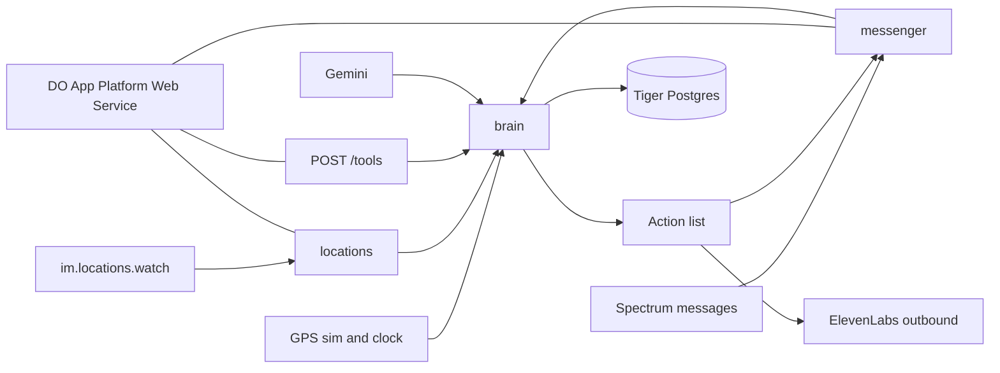
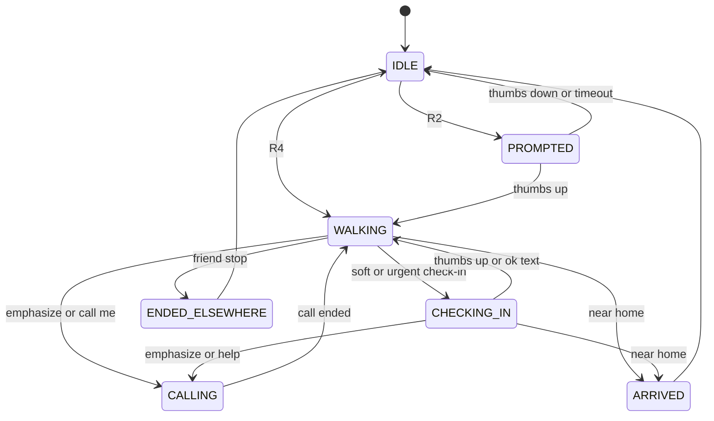

# Nook — Walk Me Home (context contract)

Shared contract for Dev A (edge) and Dev B (brain). Hackathon: 2 developers, ~20 hours. Demo reliability beats feature count. TypeScript / Bun. No LLM calls on the location-ping path.

## Product

An iMessage agent that walks users home at night. Users share Find My location with the agent's contact once. At night, when they start walking, the agent texts first ("Heading home? 👍"). During the walk it checks in only when something is unusual for that user, escalates to an emergency contact if they go quiet, and on ‼️ places a fake phone call from an AI "friend". The agent never contacts police itself.

## Stack

| Piece | Role |
| --- | --- |
| Bun + TypeScript | One backend process |
| Photon Spectrum (`spectrum-ts`) | Cloud iMessage (tapbacks need cloud, not local). Terminal provider for local testing |
| Photon Advanced iMessage kit | `im.locations.request()` / `im.locations.watch()` for Find My (live stream; not durable; tolerate gaps) |
| Tiger Cloud | Postgres + TimescaleDB + PostGIS via `pg` |
| Gemini API | Text only: writing messages, parsing free-text replies |
| ElevenLabs Agents | Outbound call (Twilio first; Photon SIP later); server tools → our HTTP endpoints |
| DigitalOcean App Platform | Always-on Web Service hosting the agent (1 instance) |
| ngrok | Local tunnel for ElevenLabs tools until App Platform URL is live |

Docs index: [https://photon.codes/docs/llms.txt](https://photon.codes/docs/llms.txt)

## Non-negotiable principles

1. No LLM call on the location-ping path. Rules are deterministic code.
2. Personalization = numbers from Tiger (typical walk time, known stops, usual route) loaded once per walk into a `WalkPlan`.
3. Safety floors ignore personalization: no-reply escalation, ‼️ call, codeword, signal loss.
4. Every fired rule is logged to `events` with a `rule_id`.
5. Injectable clock + GPS simulator: the demo never depends on real GPS/time.
6. Gemini failures fall back to message templates.

## Architecture

One Bun process. Spectrum owns texts and tapbacks. The Advanced iMessage kit owns Find My because live location is not on the durable message log and is not replayable. Terminal provider is how Dev B tests without a phone.

**Hosting:** Nook runs as an always-on DigitalOcean App Platform **Web Service** (min instances = 1, exactly one instance). Photon Cloud and Tiger Cloud stay as SaaS; DO only hosts the agent process. Locally, ngrok tunnels ElevenLabs tool routes until the App Platform URL is live.



### Invariants

- `LocationPing` handling is pure rules. Gemini runs only in `llm/writeMessages` (once, when a walk starts, L5) and `llm/parseReply` (free-text replies, L3). Template strings are the fallback and the L1–L2 default.
- Personalization is a `WalkPlan` loaded once when entering `WALKING`. Safety floors ignore it.
- Every fired rule inserts `events` with a `rule_id`. Pings are stored even when R1 suppresses prompts.
- `Clock.now()` is the only time source. The simulator never needs a real GPS fix or the real clock.

### Wiring

```
brain.handle(event): Action[]
messenger.execute(action)
```

Edge → brain: events. Brain → edge: actions. Edge → brain query: `getLiveContext(walkId)`.

### State machine



Phase lives in memory and on `walks.status` so a process restart can resume an open walk. The last-5-minute ping window stays in memory only; Tiger is the durable log. On boot: rebuild the window from recent Tiger pings and resume open walks via `walks.status`.

**Cell key** (everywhere): `round(lat, 3) + "," + round(lon, 3)` (~100 m grid).

---

## Repo structure

```
src/
  shared/
    types.ts       # events, actions, phases, walk plan, RuleId — write first, both
    clock.ts       # SystemClock, SimClock
    templates.ts   # canned strings when Gemini absent/fails
  messenger/       # Spectrum inbound → events; execute(action)
  locations/       # im.locations watch → LocationPing
  voice/           # startCall; POST /tools/location, /tools/silent-alert
  store/           # schema.sql, Tiger client, baselines / known stops
  brain/           # ping window, state machine, rules, walk-plan builder
  llm/             # writeMessages(plan), parseReply(text) — NOT imported by ping rules
  sim/             # GPS route playback, clock override, seed (2 weeks)
  dashboard/       # L5 only; reads events
  index.ts         # PROVIDER=terminal|imessage; HTTP /health + /tools/*
Dockerfile         # preferred App Platform build (Bun or Node)
.do/app.yaml       # optional App Platform spec
```

Dev B: `PROVIDER=terminal` + simulator. Dev A: same `handle`, stub brain that echoes actions if needed.

---

## TypeScript interfaces (`src/shared/types.ts`)

Discriminated unions so each side can `switch` on `type`.

```ts
/** Only time source in app code — never Date.now() for rules. */
export interface Clock {
  now(): Date;
}

export interface SimClock extends Clock {
  set(t: Date): void;
  advance(ms: number): void;
}

export type WalkPhase =
  | "IDLE"
  | "PROMPTED"
  | "WALKING"
  | "CHECKING_IN"
  | "ALERTED"
  | "CALLING"
  | "ARRIVED"
  | "ENDED_ELSEWHERE";

export type RuleId =
  | "R1"
  | "R2"
  | "R2x"
  | "R3"
  | "R4"
  | "R5a"
  | "R5b"
  | "R6"
  | "R7a"
  | "R7b"
  | "R8"
  | "R9a"
  | "R9b"
  | "R10"
  | "R11"
  | "R12" // typed; unwired until L5
  | "R13"
  | "R14"
  | "R15"
  | "R16";

export type SendTextTag =
  | "prompt"
  | "checkin"
  | "nudge"
  | "arrived"
  | "ended";

// --- Events (edge → brain) ---

export type Event =
  | LocationPing
  | UserText
  | UserReaction
  | CallEvent;

export interface LocationPing {
  type: "LocationPing";
  userId: string;
  time: Date; // Clock.now()
  lat: number;
  lon: number;
  accuracyM?: number;
  /** From Find My shortAddress when present; for getLiveContext, not LLM. */
  shortAddress?: string;
}

export interface UserText {
  type: "UserText";
  userId: string;
  messageId: string;
  text: string;
  time: Date;
}

export interface UserReaction {
  type: "UserReaction";
  userId: string;
  emoji: string; // e.g. 👍 👎 ‼️ ❓
  targetMessageId: string;
  time: Date;
}

export interface CallEvent {
  type: "CallEvent";
  userId: string;
  walkId: string;
  callType: "started" | "ended" | "silent_alert";
  time: Date;
}

/** Drop before emit if lat/lon missing. */

// --- Actions (brain → edge) ---

export type Action = SendText | AlertContact | StartCall;

export interface SendText {
  type: "SendText";
  userId: string;
  text: string;
  tag: SendTextTag;
}

export interface AlertContact {
  type: "AlertContact";
  userId: string;
  text: string;
  lat: number;
  lon: number;
}

export interface StartCall {
  type: "StartCall";
  userId: string;
  walkId: string;
  vars: {
    displayName: string;
    street: string;
    minutesWalking: number;
    walkId: string;
  };
}

/** execute(SendText) returns messageId so tapbacks can be matched. */
export type ExecuteResult = { messageId?: string };

// --- Brain ---

export interface LiveContext {
  street: string;
  lat: number;
  lon: number;
  minutesWalking: number;
}

export interface Brain {
  handle(event: Event): Promise<Action[]>;
  getLiveContext(walkId: string): Promise<LiveContext | null>;
}

// --- Walk plan (loaded once on enter WALKING) ---

export interface KnownStopPlan {
  cell: string;
  label?: string;
  kind?: string; // e.g. "friend"
  allowedDwellMin: number; // max(ok_dwell, p90+2), cap 30 (60 friend), default 10
}

export interface WalkPlan {
  expectedMin: number;
  lateMin: number;
  routeCells: string[];
  bufferM: number; // 150
  stops: KnownStopPlan[];
}

// --- LLM (not on ping path) ---

export interface ParsedReply {
  status: "ok" | "help" | "unclear";
  placeLabel?: string;
}

export type WriteMessages = (plan: WalkPlan) => Promise<Record<string, string>>;
export type ParseReply = (text: string) => Promise<ParsedReply>;
```

---

## Tiger tables (summary)

Full SQL provided separately; paste into `src/store/schema.sql`.

- `users(user_id, home geog, contact, codeword, night_start, night_end, tz)`
- `location_pings` hypertable `(time, user_id, lat, lon, accuracy_m, geom, cell, walk_id)`
- `walks(walk_id, user_id, trigger, started_at, ended_at, origin_cell, duration_s, status)`
- `stops(...)`, `place_labels(...)`, `events` hypertable `(..., rule_id, detail jsonb)`
- `presence_hourly` CAGG; views `walk_baselines` (p50/p90 by origin), `known_stops`

---

## Rules (starting thresholds)

| Id | Behavior |
| --- | --- |
| R1 | Outside night hours: no prompts/check-ins (pings still stored) |
| R2 | IDLE, night, speed 0.7–2.2 m/s for 2 min, moved ≥120 m, >150 m from home, no prompt in 2 h → prompt |
| R2x | Speed >3 m/s = vehicle → skip prompt |
| R3 | 👍 start walk \| 👎 cooldown 2 h \| none in 10 min → cooldown 1 h |
| R4 | Text "walk me home" → start walk any time |
| R5a | Stationary near known stop: silent until allowed dwell |
| R5b | Stationary 3 min elsewhere (2 min after midnight): soft check-in |
| R6 | >200 m from route for 2 min: soft check-in |
| R7a | Elapsed > late: soft check-in |
| R7b | > late+10 min: urgent |
| R8 | No ping 4 min: check-in; 10 min + no reply: alert contact (**floor**) |
| R9a | 👍 to check-in: resume; no same-type check-in for 10 min |
| R9b | Free text → Gemini: ok (save place label) \| help (call + alert) \| unclear |
| R10 | No reply 60 s: second ping; +60 s: alert contact w/ location (**floor**) |
| R11 | ‼️ or "call me": ElevenLabs call immediately (**floor**) |
| R12 | ❓ → nearest open place (extension / L5 only) |
| R13 | Codeword tool: alert contact, call continues (**floor**) |
| R14 | Within 50 m of home, 2 pings: "got home" to contact, close walk |
| R15 | Friend place >15 min or reply says so: end walk, tell contact |
| R16 | Max one check-in per 3 min; none while CALLING |

**Walk plan builder:** `expected = p50` when `n >= 3`, else `dist / 1.3 m/s`; `late = max(p90 * 1.25, expected + 5 min)`; route = past walk cells else directions + 150 m buffer; known stops = visits ≥2 + `place_labels`; allowed dwell = `max(ok_dwell, p90 dwell + 2)`, cap 30 (60 friend), default 10.

---

## Deploy (DigitalOcean App Platform)

- **Target:** App Platform Web Service connected to GitHub. Not Functions, not scale-to-zero.
- **Instances:** min = 1, max = 1. In-memory ping window and walk phase must not split across replicas.
- **Process model:** one container runs HTTP + Spectrum loop + `im.locations.watch`. Restart rebuilds the window from recent Tiger pings and resumes open walks via `walks.status`.
- **HTTP:** `/health` (health check), `/tools/location`, `/tools/silent-alert` (shared secret header).
- **Secrets (env):** `SPECTRUM_PROJECT_ID`, `SPECTRUM_PROJECT_SECRET`, Tiger connection string, `GEMINI_API_KEY`, `ELEVENLABS_API_KEY`, agent/phone ids, tools shared secret, `PROVIDER`.
- **Public URL:** App Platform HTTPS for ElevenLabs tool webhooks. ngrok only for local L4 before first deploy.
- **Build:** Prefer `Dockerfile` (Bun or Node). Avoid relying on DO buildpacks for Bun. Optional `.do/app.yaml`.
- **Fallback:** if App Platform fights Bun/gRPC mid-hackathon, same Dockerfile on a small Droplet; do not change app architecture.
- **Who:** Dev A owns first App Platform ship once L1 messaging works.

---

## Ordered task list

### Shared (before the split)

1. `src/shared/types.ts`, `clock.ts`, `templates.ts`
2. Empty `handle` that returns `[]` and logs the event
3. Onboarding utterance:
   - First inbound text creates the user
   - Agent sends the Find My request card
   - User replies `contact +1... codeword <word>`
   - `HOME` while a fix is live writes `users.home`
   - Night window defaults `22:00–06:00` in `users.tz`

### Dev A — edge (`messenger/`, `locations/`, `voice/`, onboarding)

| Layer | Tasks |
| --- | --- |
| **L1** | Spectrum terminal + cloud switch. Map text and tapbacks (`Emoji.like` / `dislike` / `emphasize` / `question`) to events. `SendText` and `AlertContact` (iMessage to contact; both numbers iMessage-capable). Location `request(chatGuid, address)` then `watch(address)` with reconnect, `sourceSequence` dedupe, skip empty coordinates. Onboarding above. |
| **L2** | Remember outbound `messageId` per tag so a tapback targets the open check-in. Second-ping and contact-alert copy. |
| **L3** | Pass last `shortAddress` into the ping side-channel the brain stores on the walk. No new rules. |
| **L4** | ElevenLabs Twilio outbound `POST /v1/convai/twilio/outbound-call` with `dynamic_variables.walk_id`. Tool routes call `getLiveContext` and emit `CallEvent`. Shared secret header. Local ngrok until App Platform URL exists; then point ElevenLabs tools at DO HTTPS. |
| **L4b** | Dockerfile + App Platform Web Service (1 instance, always-on, `/health`). Wire env secrets. Confirm Spectrum + location watch survive a deploy (walk resumes from Tiger). |
| **L5** | Photon SIP trunk instead of Twilio. Only after L4 calls work. |

### Dev B — brain (`store/`, `brain/`, `llm/`, `sim/`, dashboard)

| Layer | Tasks |
| --- | --- |
| **L1** | Apply SQL. Insert every ping. In-memory window. Rules R1, R2, R2x, R3, R4, R14. Log each fire. Simulator plays a scripted route into `handle`. |
| **L2** | Default plan only: `expected = distanceMeters / 1.3`, `late = expected + 5`. Rules R5b, R7a/R7b, R8, R9a, R10, R16. |
| **L3** | Seed ~2 weeks. Query `walk_baselines` + `known_stops` once into `WalkPlan`. Rules R5a, R6, R9b (`parseReply`; ok → `place_labels`; help → call + alert; Gemini failure → unclear template), R15. |
| **L4** | R11 → `CALLING` + `StartCall` immediately. R13 on `silent_alert` → `AlertContact`, stay `CALLING`. `getLiveContext` reads the window — no model call. |
| **L5** | `writeMessages(plan)` at walk start only; dashboard of `events` by `rule_id`; R12 if time remains. |

A layer is done when its rules pass under `PROVIDER=terminal` with `SimClock`.

---

## Simulator test plan (per rule)

Each case: set clock, play points, assert phase, `events.rule_id`, and action types. No phone and no Gemini (stub `parseReply` for R9b).

| Rule | Script |
| --- | --- |
| **R1** | 14:00, walking speed → zero `SendText`, ping row exists |
| **R2** | Night, 0.7–2.2 m/s for 2 min, ≥120 m, >150 m from home → one prompt. Repeat inside 2 h → no second prompt |
| **R2x** | Speed >3 m/s → no prompt |
| **R3** | 👍 → `WALKING`. 👎 → cooldown 2 h. No reply 10 min → cooldown 1 h |
| **R4** | Text `walk me home` at noon → `WALKING` |
| **R5a** | Dwell on seeded known stop under `allowedDwellMin` → silence. Past cap → R5b can fire |
| **R5b** | 3 min still off known stop → one `checkin`. After midnight same fixture fires at 2 min |
| **R6** | Leave seeded polyline by >200 m for 2 min → `checkin` |
| **R7a / R7b** | Advance past `late`, then `late + 10` |
| **R8** | Stop pings 4 min → check-in; 10 min no reply → `AlertContact` even if plan says user often goes dark (**floor**) |
| **R9a** | 👍 on check-in → `WALKING`, same tag suppressed 10 min |
| **R9b** | Stub `parseReply` for ok / help / unclear. Thrown stub → unclear template |
| **R10** | Check-in, +60 s → nudge; +60 s → `AlertContact` with last lat/lon (**floor**) |
| **R11** | ‼️ or `call me` from `WALKING` → `StartCall` + `CALLING` before any other rule (**floor**) |
| **R13** | Inject `CallEvent` `silent_alert` → `AlertContact`, phase stays `CALLING` (**floor**) |
| **R14** | Two pings inside 50 m of home → arrived text, `IDLE` |
| **R15** | Dwell >15 min on `friend` label, or stub “I’m at Sam’s” → `ENDED_ELSEWHERE` + contact text |
| **R16** | Two check-in conditions 1 min apart → one send. Same during `CALLING` → zero sends |
| **R12** | Not in the demo gate |

---

## API details to verify before coding

### Photon

- [Locations](https://photon.codes/docs/advanced-kits/imessage/locations): `request(chatGuid, e164OrEmail)` only sends a card; `watch(address)` is a separate non-durable stream; heartbeats exist; coordinates and `accuracy` are optional; `sourceSequence` ≠ message cursor. Confirm npm package (`@photon-ai/advanced-imessage` vs Spectrum iMessage export) and same cloud line as `spectrum-ts`.
- [Tapback reactions](https://photon.codes/docs/spectrum-ts/providers/imessage/messaging-features/tapback-reactions): inbound reaction content shape; whether outbound `message.id` is what a later tapback references. Cloud only; local iMessage cannot demo ‼️. [Terminal](https://photon.codes/docs/spectrum-ts/providers/terminal/setup-and-usage) can.
- Spectrum send return value so `SendText` can store `messageId`. Creating a second space to text the emergency contact.
- [Photon + ElevenLabs SIP](https://photon.codes/docs/beta/cookbooks/voice/elevenlabs): L5 only; shared iMessage lines cannot do voice.

### ElevenLabs

- Twilio outbound body: `agent_id`, `agent_phone_number_id`, `to_number`, `conversation_initiation_client_data.dynamic_variables`. Confirm whether `type: "conversation_initiation_client_data"` is required.
- Webhook tool POST shape: `tool_call_id`, `tool_name`, `parameters`, `conversation_id`; shared-secret header.
- Force `walk_id` into the tool call via dynamic variable binding (not the model).
- Which webhook / event marks call ended.

### Tiger

- Connection string; `geography` + hypertable syntax on this project; continuous-aggregate lag. If `presence_hourly` is stale during the demo, baselines read raw `location_pings` instead.

### Gemini

- Model id and JSON response schema for `parseReply`. Timeout budget short enough that a hang becomes the template path.

### DigitalOcean App Platform

- Bun via Dockerfile vs Node; health-check path and port; whether long-lived gRPC to Photon stays open without idle kill; env/secret injection from the App Platform UI or `.do/app.yaml`.

---

## Build layers (demo gates)

| Layer | Must demo alone |
| --- | --- |
| L1 | Onboarding + location ingest + R1–R4 + R14 |
| L2 | Check-ins + escalation (R5b, R7, R8, R9a, R10, R16) with default plan |
| L3 | Personalization (seed, walk plan, R5a, R6, R9b, R15) |
| L4 | Fake call + codeword (R11, R13) + App Platform always-on |
| L5 | Gemini-written messages, Photon SIP, rule dashboard, R12 extension |
