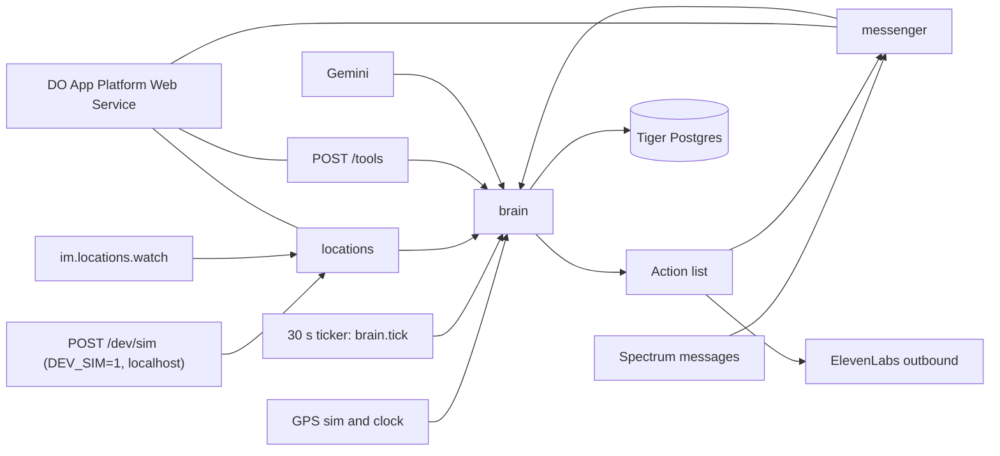
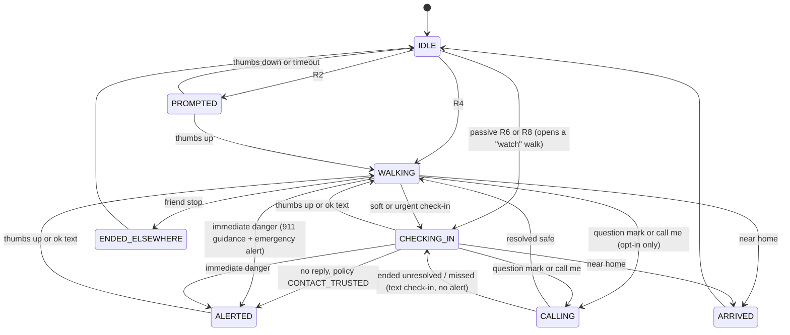

# Nook — Walk Me Home (context contract)

Shared contract for Dev A (edge) and Dev B (brain). Hackathon: 2 developers, ~20 hours. Demo reliability beats feature count. TypeScript / Bun. No LLM calls on the location-ping path.

**Team to-do lists / ownership:** [TEAM.md](TEAM.md)

## Product

An iMessage agent that walks users home at night. Users share Find My location with the agent's contact once. When Nook is watching (the user picks when: only trips they start, evenings, or whenever they're away from home) and they start walking, the agent texts first ("Heading home? 👍"). During the walk it checks in only when something is unusual for that user (stopped, off their usual route, late, or no location updates). If a check-in goes unanswered it nudges once, then takes the step the user chose (text their trusted contact, or just keep checking in). It never calls on its own: a voice call is an opt-in hands-free companion the user asks for (❓ or "call me"). If the user says they're in immediate danger (‼️, text, voice note, or on a call) Nook tells them to call 911 and texts their trusted contact a detailed alert right away. Arriving home texts the user, not the contact: the trusted contact hears from Nook only when something is wrong. The agent never contacts police itself.

## Stack

| Piece | Role |
| --- | --- |
| Bun + TypeScript | One backend process |
| Photon Spectrum (`spectrum-ts`) | Cloud iMessage (tapbacks need cloud, not local). Terminal provider for local testing |
| Photon Advanced iMessage kit | `im.locations.request()` / `im.locations.watch()` for Find My (live stream; not durable; tolerate gaps) |
| Tiger Cloud | Postgres + TimescaleDB + PostGIS via `pg` |
| Gemini API | Text only: writing messages, parsing free-text replies |
| ElevenLabs Agents | Outbound call (Twilio first; Photon SIP later); server tools → our HTTP endpoints |
| DigitalOcean App Platform | Always-on Web Service hosting the agent (1 instance) |
| ngrok | Local tunnel for ElevenLabs tools until App Platform URL is live |

Docs index: [https://photon.codes/docs/llms.txt](https://photon.codes/docs/llms.txt)

## Non-negotiable principles

1. No LLM call on the location-ping path. Rules are deterministic code.
2. Personalization = numbers from Tiger (typical walk time, known stops, usual route) loaded once per walk into a `WalkPlan`.
3. Safety floors always act and ignore personalization: an unanswered check-in (R10), no location updates (R8), immediate danger (R9b / ‼️). The user's setting decides *which* action R10 takes (text the contact, or keep checking in at a slower cadence), never *whether* it acts. Immediate danger always alerts the trusted contact, whatever the setting.
3a. Calls never escalate. Silence, a missed call, or a call that ends unresolved never places a call and never alerts anyone by itself; it becomes a text check-in. Once immediate danger is established Nook never starts a call (911 takes precedence); a call already in progress can continue.
3b. Copy tone: calm, attentive, useful, normal capitalization. Not emotionally needy, not overly comforting, never narrating Nook's own companionship. Ambiguous danger gets only "Are you in immediate danger right now? Reply yes or no."
4. Every fired rule is logged to `events` with a `rule_id`.
5. Injectable clock + GPS simulator: the demo never depends on real GPS/time.
6. Gemini failures fall back to message templates.
7. The trusted contact is texted only when something is wrong (an unanswered check-in with `CONTACT_TRUSTED`, or immediate danger). After each contact alert the user is told truthfully whether it (and any voice-message attachment) went through. No "made it home" or "ended elsewhere" texts to the contact.
8. User settings are deterministic and structured (`UserSettings`), set in onboarding or by text, confirmed before saving, and stored in Tiger.

## Safety model

Safety state (`safe` / `uneasy` / `immediate_danger`) is separate from the channel (`text` / `voice`). Every input (tapback, text, voice note, call tool) becomes a `SafetyIntent` and goes through `applyIntent` in `brain/engine.ts`.

| Input | Intent | What Nook does |
| --- | --- | --- |
| 👍 / "i'm ok" | `safe` | Resume; if the contact was alerted, text them "update: they're okay" |
| 👎 / "sketchy", "someone walking behind me" | `uneasy` | Never alerts. Asks "keep heading to {destination}, or somewhere busier first?"; busier → up to 3 open places from the nav provider, reply 1–3; offers a call once |
| ❓ / "call me" | `call` | Hands-free voice companion with a reason (`manual_call`, `uneasy_companion`, `navigation_help`, `lost`, `hands_free_guidance`) and a server-picked `opening_line` |
| ‼️ / "he has a knife", "call 911" | `danger` clear | "Call 911 now", emergency alert to the trusted contact (even with escalation `NONE`), danger window opens |
| "help", "someone is following me" | `danger` ambiguous | Asks "are you in immediate danger? yes/no" first; yes / ‼️ → clear danger with the confirmation quoted; no → uneasy |

Every message that relies on tapbacks also states the options in words (`LEGEND`, appended in code). The emergency alert (`shared/alerts.ts`) has labelled lines: who (name + number), confirmed time and channel, street, coordinates, fix age, what they said (labelled by source), nook's response, trip, map link, "please call them now". While the danger window is open, new voice notes are forwarded as the original audio plus a labelled machine transcript (deduped by message id, max 5). Messages are sent text first, then audio, then transcript, and the user is told exactly what went through.

Destinations: on trip start Nook asks for an Apple Maps place. Full `maps.apple.com` links (ll / q / daddr / address), rich links, coordinates, and "heading to X" (geocoded) set `walks.dest_*`. Short `maps.apple` links aren't expanded yet; Nook asks for the full link.

Navigation (`src/nav`): `NAV_PROVIDER=fixture` (hand-written 2–3 step routes around Columbia, default) or `geoapify` (live, per-request fallback to the fixture). Guidance needs a fix ≤ `NAV_STALE_SECONDS` (30); describing location / alerts uses ≤ 90 s. Off route > `NAV_OFF_ROUTE_METERS` (60) reroutes at most every `NAV_REROUTE_COOLDOWN_SECONDS` (20).

Voice tools (`POST /tools/*`, header `x-tools-secret`): `location`, `navigation`, `safe-destinations`, `set-destination {choice: home|trip|place_id}`, `call-outcome {outcome, situation?}`. `request_escalation` = immediate danger with `situation` quoted to the contact; `ended_unresolved` = text check-in only.

## Architecture

One Bun process. Spectrum owns texts and tapbacks. The Advanced iMessage kit owns Find My because live location is not on the durable message log and is not replayable. Terminal provider is how Dev B tests without a phone.

**Hosting:** Nook runs as an always-on DigitalOcean App Platform **Web Service** (min instances = 1, exactly one instance). Photon Cloud and Tiger Cloud stay as SaaS; DO only hosts the agent process. Locally, ngrok tunnels ElevenLabs tool routes until the App Platform URL is live.



### Invariants

- `LocationPing` handling is pure rules. Gemini runs only in `llm/writeMessages` (once, when a walk starts, L5) and `llm/classify` (free text and voice-note transcripts → `SafetyIntent`).
- Classification is layered (`src/llm/classify.ts`): (1) `classifyDeterministic`: tapbacks, short replies read against `awaiting` (danger confirmation / route choice / place choice / check-in), a narrow clear-danger list, stop, call, route choice, safe / place, with negation handling; (2) Gemini for anything left, JSON only, constrained by `intentJsonSchema` and validated with zod (`intentSchema`), one repair retry on malformed output; (3) `classifyConservative` (ambiguous danger / uneasy / unclear, never safe or clear danger) when Gemini is off, fails, or returns invalid output twice, and as the guard around Gemini (`guardIntent`: Gemini never produces clear danger, only the confirmation question; messages the conservative layer reads as possible danger skip Gemini entirely; and Gemini can't turn unease into safe). Precedence: clear danger > stop > call > route choice > safe > uneasy > unclear. The classifier returns `{ intent, classifier }`; the quote is always the user's own words, filled in by the server.
- All state changes happen in the engine's `applyIntent`; the classifier never writes state. Inputs are de-duplicated by message id (reactions by id, or emoji + target within 2 min; call callbacks by walk + outcome + text within 60 s) so a redelivery can't alert twice, forward a voice note twice, start a second call, or repeat a place lookup. Each applied intent logs message id, source, classifier, intent, safety before → after and side effects; the user's words are stored once, in that `R9b` statement event.
- Input modality affects convenience, not safety semantics: 👎, "this area feels weird" and a voice note saying it take the same path.
- Personalization is a `WalkPlan` loaded once when entering `WALKING`. Safety floors ignore it.
- Every fired rule inserts `events` with a `rule_id`. Pings are stored even when R1 suppresses prompts.
- `Clock.now()` is the only time source. The simulator never needs a real GPS fix or the real clock.
- Find My only sends pings when the phone moves, so time-based rules can't wait for the next ping. `evaluateTimers` runs on every ping *and* on a 30 s `brain.tick(now)` from `index.ts`: R3 timeout, R10 nudge / escalation, R8 no-update, R5a / R5b / R15 dwell, R7 late. `handle` and `tick` are serialized inside the engine.

### Wiring

```
brain.handle(event): Action[]
brain.tick(now): Action[]     // every 30 s
messenger.execute(action)
```

Edge → brain: events. Brain → edge: actions. Edge → brain query: `getLiveContext(walkId)`.

Inbound texts go through the deterministic onboarding / settings router (`messenger/onboarding.ts`) first. Anything that isn't onboarding or a settings intent is dispatched to the brain as `UserText`. In-thread replies (Spectrum `reply` content) and shared contact cards are flattened to text first, and Nook answers inside the same thread.

Actions run in order through `runActions` (`index.ts`). If `StartCall` throws, the brain receives `CallEvent` `ended_unresolved` and answers with a text check-in (never a contact alert). When no call transport is configured the brain doesn't emit `StartCall` at all and replies by text instead.

Voice notes (`voice` content or audio attachments) are saved to `data/voice-notes/`, transcribed with ElevenLabs Scribe (macOS `afconvert` → WAV fallback), recorded in `voice_notes`, and dispatched as `UserText` with `voiceNote` set, so they go through exactly the same pipeline as typed text. Shared Apple Maps places (rich links) are flattened to their URL.

### State machine



An unanswered check-in gets exactly one follow-up. With policy `NONE`, Nook then goes quiet and checks in again 10 minutes later with a plain "Checking in again. Everything okay?" (never a more urgent-sounding "final nudge").

Phase lives in memory and on `walks.status` so a process restart can resume an open walk. The last-5-minute ping window stays in memory only; Tiger is the durable log. On boot (first tick) the engine lists open walks in Tiger, resumes them, and rebuilds the window and last ping from recent Tiger pings. A walk resumed in `CHECKING_IN` restarts its reply timers from the resume time.

**Cell key** (everywhere): `round(lat, 3) + "," + round(lon, 3)` (~100 m grid).

---

## Repo structure

```
src/
  shared/
    types.ts       # events, actions, phases, walk plan, RuleId — write first, both
    clock.ts       # SystemClock, SimClock
    templates.ts   # canned strings when Gemini absent/fails
    settings.ts    # UserSettings (monitoring, contact, escalation, timeouts)
  messenger/       # Spectrum inbound → events; execute(action)
    onboarding.ts  # deterministic onboarding + settings router (confirm before save)
    parse.ts       # keyword parsers (contact, choices, yes/no, durations, intents)
    copy.ts        # every onboarding / settings string
    alertDelivery.ts # text → audio → transcript delivery + truthful user notices
  locations/       # im.locations watch → LocationPing
  voice/           # calls (ElevenLabs / Vonage bridge / tap-to-talk), transcribe.ts (Scribe), notes.ts (voice-note ingest)
  nav/             # NavProvider (fixture.ts + fixtures.json, geoapify.ts), service.ts (routes, reroute, safe places)
  store/           # schema.sql, Tiger client, baselines / known stops / usual cells, voiceNotes.ts
  brain/           # ping window, state machine, rules, timers, walk-plan builder, applyIntent
  llm/             # writeMessages(plan), classify(text) → SafetyIntent — NOT imported by ping rules
  sim/             # GPS route playback, clock override, seed (2 weeks), live.ts (real-time feed)
  scripts/         # migrate, seed-history, sim-live, events-tail, send-test
  dashboard/       # L5 only; reads events
  index.ts         # PROVIDER=terminal|imessage; HTTP /health, /tools/* (+ /dev/sim with DEV_SIM=1); 30 s ticker
tests/             # bun test suite (`bun run test`): parity, danger, contact payload, calls, nav, voice notes, copy
Dockerfile         # preferred App Platform build (Bun or Node)
.do/app.yaml       # optional App Platform spec
```

Dev B: `PROVIDER=terminal` + simulator. Dev A: same `handle`, stub brain that echoes actions if needed.

---

## TypeScript interfaces (`src/shared/types.ts`)

Discriminated unions so each side can `switch` on `type`.

```ts
/** Only time source in app code — never Date.now() for rules. */
export interface Clock {
  now(): Date;
}

export interface SimClock extends Clock {
  set(t: Date): void;
  advance(ms: number): void;
}

export type WalkPhase =
  | "IDLE"
  | "PROMPTED"
  | "WALKING"
  | "CHECKING_IN"
  | "ALERTED"
  | "CALLING"
  | "ARRIVED"
  | "ENDED_ELSEWHERE";

export type RuleId =
  | "R1"
  | "R2"
  | "R2x"
  | "R3"
  | "R4"
  | "R5a"
  | "R5b"
  | "R6"
  | "R7a"
  | "R7b"
  | "R8"
  | "R9a"
  | "R9b"
  | "R10"
  | "R11"
  | "R12" // typed; unwired until L5
  | "R14"
  | "R15"
  | "R16";

export type SendTextTag =
  | "prompt"
  | "started" // walk acknowledged (R3 👍, R4)
  | "checkin"
  | "nudge"
  | "arrived"
  | "ended";

// --- Events (edge → brain) ---

export type Event =
  | LocationPing
  | UserText
  | UserReaction
  | CallEvent;

export interface LocationPing {
  type: "LocationPing";
  userId: string;
  time: Date; // Clock.now()
  lat: number;
  lon: number;
  accuracyM?: number;
  /** From Find My shortAddress when present; for getLiveContext, not LLM. */
  shortAddress?: string;
}

export interface UserText {
  type: "UserText";
  userId: string;
  messageId: string;
  text: string;
  time: Date;
}

export interface UserReaction {
  type: "UserReaction";
  userId: string;
  emoji: string; // e.g. 👍 👎 ‼️ ❓
  targetMessageId: string;
  time: Date;
}

/** Picking up is not being safe: only `resolved_safe` calls off a pending contact step. */
export type CallOutcome =
  | "started"            // user answered; outcome unknown
  | "resolved_safe"      // user confirmed on the call they're okay
  | "request_escalation" // user asked for their trusted contact to be reached
  | "ended_unresolved";  // hung up / dropped / unanswered / failed to place, without a safe outcome

export interface CallEvent {
  type: "CallEvent";
  userId: string;
  walkId: string;
  callType: CallOutcome;
  time: Date;
}

/** Drop before emit if lat/lon missing. */

// --- Actions (brain → edge) ---

export type Action = SendText | AlertContact | StartCall;

export interface SendText {
  type: "SendText";
  userId: string;
  text: string;
  tag: SendTextTag;
}

export interface AlertContact {
  type: "AlertContact";
  userId: string;
  text: string;
  lat: number;
  lon: number;
}

export interface StartCall {
  type: "StartCall";
  userId: string;
  walkId: string;
  vars: {
    displayName: string;
    street: string;
    minutesWalking: number;
    walkId: string;
  };
}

/** execute(SendText) returns messageId so tapbacks can be matched. */
export type ExecuteResult = { messageId?: string };

// --- Brain ---

export interface LiveContext {
  street: string;
  lat: number;
  lon: number;
  minutesWalking: number;
}

export interface Brain {
  handle(event: Event): Promise<Action[]>;
  getLiveContext(walkId: string): Promise<LiveContext | null>;
  /** Time-based rules (reply timers, no-update, lateness). Called every 30 s. */
  tick?(now: Date): Promise<Action[]>;
}

// --- Walk plan (loaded once on enter WALKING) ---

export interface KnownStopPlan {
  cell: string;
  label?: string;
  kind?: string; // e.g. "friend"
  allowedDwellMin: number; // max(ok_dwell, p90+2), cap 30 (60 friend), default 10
}

export interface WalkPlan {
  expectedMin: number;
  lateMin: number;
  routeCells: string[];
  bufferM: number; // 150
  stops: KnownStopPlan[];
}

// --- LLM (not on ping path) ---

export type SafetyIntent =
  | { kind: "safe" }
  | { kind: "uneasy"; detail?: string; wants?: RouteChoice; lost?: boolean }
  | { kind: "call"; reason?: CallReason; uneasy?: boolean }
  | { kind: "danger"; clear: boolean; quote: string; wantsCall?: boolean } // wantsCall only shortens the guidance; Nook never calls in danger
  | { kind: "route_choice"; choice: RouteChoice }
  | { kind: "place"; label: string }
  | { kind: "stop" }
  | { kind: "unclear" };

export type Awaiting = "danger_confirmation" | "route_choice" | "place_choice" | "checkin" | null;
export interface ClassifyContext { safetyState: SafetyState; awaiting: Awaiting; destination?: string; recent: { from: "user" | "nook"; text: string }[] }
export interface Classification { intent: SafetyIntent; classifier: "reaction" | "context" | "deterministic" | "gemini" | "fallback" }

export type WriteMessages = (plan: WalkPlan) => Promise<Record<string, string>>;
/** Typed text or a voice-note transcript → SafetyIntent. Classifies only; the engine owns state. */
export type ClassifyInput = (text: string, ctx: ClassifyContext) => Promise<Classification>;
```

### User settings (`src/shared/settings.ts`)

Set during onboarding or by texting later; read by the brain through `UserRecord` (which extends `UserSettings`). Stored as `users` columns in Tiger.

```ts
export type MonitoringMode = "MANUAL" | "EVENINGS" | "AWAY_FROM_HOME";
export type NoResponseAction = "CONTACT_TRUSTED" | "NONE";

export interface TrustedContact { name?: string; phone: string /* E.164 */ }

/** Always a text check-in first, then `onNoTextResponse`. */
export interface EscalationPolicy {
  initialAction: "TEXT_USER";
  onNoTextResponse: NoResponseAction;
}

/** Defaults 60 s / 60 s / 3 min; clamped to 30–600 s and 2–15 min. */
export interface CheckinTimeouts {
  nudgeAfterSec?: number;     // check-in → nudge
  escalateAfterSec?: number;  // nudge → escalation step
  noUpdateMin?: number;       // silence before an R8 check-in
}

export interface UserSettings {
  monitoringMode?: MonitoringMode;
  trustedContact?: TrustedContact;
  escalation?: EscalationPolicy;
  timeouts?: CheckinTimeouts;
}
```

Legacy values are migrated: `CALL_THEN_CONTACT` → `CONTACT_TRUSTED`, `CALL_USER` → `NONE` (`normalizeNoResponseAction`, plus an UPDATE in `schema.sql`). Calls are never an escalation step. Defaults when a setting is missing: monitoring behaves as `EVENINGS`; escalation is `CONTACT_TRUSTED` if a contact exists, else `NONE`.

---

## Tiger tables (summary)

Full SQL provided separately; paste into `src/store/schema.sql`.

- `users(user_id, handle, home geog, contact, night_start, night_end, tz, display_name, ...)`
  - Settings columns (added with `ADD COLUMN IF NOT EXISTS`): `trusted_name`, `monitoring_mode`, `escalation_on_no_response`, `nudge_after_sec`, `escalate_after_sec`, `no_update_min`, `onboarded_at`.
  - `contact` is the trusted contact's phone.
- `location_pings` hypertable `(time, user_id, lat, lon, accuracy_m, geom, cell, walk_id)`
- `walks(walk_id, user_id, trigger, started_at, ended_at, origin_cell, duration_s, status, safety_state, route_choice, dest_name, dest_lat, dest_lon, dest_address, interim_name, interim_lat, interim_lon)`. `trigger` is `prompt` / `walk_me_home` / `watch` (opened by a passive check) / `call_me` / `help`. Recent statements stay in memory + `events`.
- `voice_notes(id, user_id, walk_id, received_at, path, mime_type, transcript, status, forwarded_at)`: inbound voice notes; audio files live in `data/voice-notes/` (git-ignored).
- `confirmed_cells(user_id, cell, created_at)`: off-route stretches the user confirmed; part of their usual route from then on.
- `stops(...)`, `place_labels(...)`, `events` hypertable `(..., rule_id, detail jsonb)`
- `presence_hourly` CAGG; views `walk_baselines` (p50/p90 by origin), `known_stops`

`bun run db:migrate` applies the whole `schema.sql`; every statement is idempotent.

---

## Rules (starting thresholds)

"Watching" (`isWatching`) is the monitoring gate for everything outside an explicit walk: `MANUAL` never, `EVENINGS` inside the night window (`night_start`–`night_end` in `users.tz`), `AWAY_FROM_HOME` whenever the last ping is >150 m from home. Explicit walks are always watched. "Passive" below means: no walk open, watching, and >150 m from home; a passive check opens a walk with `trigger = 'watch'` (dwell and lateness rules don't apply to watch walks).

| Id | Behavior |
| --- | --- |
| R1 | Not watching and no walk: pings are stored, nothing is sent |
| R2 | IDLE, watching, speed 0.7–2.2 m/s for 2 min, moved ≥120 m, >150 m from home, no prompt in 2 h → prompt |
| R2x | Speed >3 m/s = vehicle → skip prompt |
| R3 | 👍 start walk (with a "started" ack) \| 👎 cooldown 2 h \| none in 10 min → cooldown 1 h |
| R4 | Text "walk me home" → start walk any time (closes any walk still open). With no walk open, trip phrases also start one: "walking home", "heading home / out / back", "on my way (home)", "going home", "leaving now", "start(ing) my walk / trip". Replies with the "started" ack. This is how `MANUAL` users start being watched |
| R5a | Stationary near known stop: silent until allowed dwell |
| R5b | Stationary 3 min elsewhere (2 min after midnight): soft check-in |
| R6 | >200 m from every usual cell for 2 min, on a walk or passive: off-route check-in. Usual cells = ping cells of past walks that ended `ARRIVED` + `confirmed_cells` (200 m ≈ one-cell buffer). Skipped with <3 arrived walks and no confirmed cells. 👍 or an "ok" reply confirms: the stretch's cells go to `confirmed_cells` (plus a place label if named) and the rest of that trip is added too. No reply: R10 escalation |
| R7a | Elapsed > late: soft check-in |
| R7b | > late+10 min: urgent |
| R8 | No location update for `noUpdateMin` (default 3) while walking, or passive: check-in. Timer-driven; once per silence. No reply: R10 escalation (**floor**) |
| R9a | 👍 to check-in (or after an alert): resume; no check-in for 10 min |
| R9b | Text / voice note / tapback → `SafetyIntent` (see Safety model): safe (save place label; confirms off-route) \| uneasy \| call \| danger (clear → 911 + emergency alert; ambiguous → confirm) \| route choice \| unclear (options spelled out, timers keep running) |
| R10 | No reply `nudgeAfterSec` (60): nudge; +`escalateAfterSec` (60): the user's `onNoTextResponse`. `CONTACT_TRUSTED` → alert contact with name, number and location; `NONE` → no message, then a plain re-check 10 min later (**floor**). Never a call. The nudge tells the user their next step and its timing |
| R11 | ❓ or "call me": opt-in voice companion call (text reply instead when calls aren't configured). Call outcomes: `resolved_safe` → walking; `request_escalation` → immediate danger; `ended_unresolved` → text check-in only |
| R12 | Uneasy → "busier" → up to 3 open places from the nav provider |
| R17 | Destination shared (Apple Maps link / coordinates / "heading to X"), or busier stop picked; arrival acknowledged |
| R14 | Within 50 m of home, 2 pings, on a walk (or passive after ≥2 pings away): text the user "I see that you got home safe. Have a good rest!", close walk. No contact text |
| R15 | Friend place >15 min or reply says so: end walk quietly. No contact text |
| R16 | Max one check-in per 3 min; none while CALLING |

**Walk plan builder:** `expected = p50` when `n >= 3`, else `dist / 1.3 m/s`; `late = max(p90 * 1.25, expected + 5 min)`; known stops = visits ≥2 + `place_labels`; allowed dwell = `max(ok_dwell, p90 dwell + 2)`, cap 30 (60 friend), default 10. Usual-route cells for R6 are loaded per user (cached 10 min), not per walk.

---

## Deploy (DigitalOcean App Platform)

- **Target:** App Platform Web Service connected to GitHub. Not Functions, not scale-to-zero.
- **Instances:** min = 1, max = 1. In-memory ping window and walk phase must not split across replicas.
- **Process model:** one container runs HTTP + Spectrum loop + `im.locations.watch`. Restart rebuilds the window from recent Tiger pings and resumes open walks via `walks.status`.
- **HTTP:** `/health` (health check), plus the ElevenLabs webhook tools, both `POST` with header `x-tools-secret: $TOOLS_SECRET` and parameters flat or under `parameters`:
  - `/tools/location` `{ walk_id }` → `getLiveContext` JSON (`street`, `lat`, `lon`, `minutesWalking`).
  - `/tools/call-outcome` `{ user_id, walk_id, outcome }` with `outcome` one of `started` / `resolved_safe` / `request_escalation` / `ended_unresolved` → `CallEvent`.
  - `/talk/<token>` (tap to talk): used instead of a phone call when `ELEVENLABS_AGENT_PHONE_NUMBER_ID` is empty and `PUBLIC_URL` is set. `StartCall` texts the user "📞 Tap to talk to me now: <link>". The page gets a short-lived WebRTC token from our server and talks to the same agent with the same variables. Opening the conversation counts as `started`; a link not opened within 3 min, or a conversation that ends without `resolved_safe`, counts as `ended_unresolved`. Links expire after 30 min.
  - Vonage calls: used instead of tap to talk when `VONAGE_APPLICATION_ID` and `VONAGE_PRIVATE_KEY_PATH` (or `VONAGE_PRIVATE_KEY`) are set. The Vonage Voice API dials the user and streams the call audio to `wss://<PUBLIC_URL>/vonage/ws/<token>`, which `src/voice/vonage.ts` relays to the agent's conversation WebSocket (16 kHz PCM both ways). Call status arrives at `/vonage/event/<token>`: busy / no answer / voicemail / hang-up without a final outcome count as `ended_unresolved`; a call Vonage refuses to place (`failed` / `rejected`, e.g. a trial account calling an unregistered number) falls back to a tap-to-talk link. Trial accounts can only call their registered number, with caller ID `123456789`.
  - `POST /dev/call {"handle": "+1…"}` (DEV_SIM=1, localhost) places a test check-in call outside any walk.
  - `bun run voice:setup <public url>` creates / updates the tools and agent (and imports a Twilio number when `TWILIO_*` is set). Re-run it when the public URL changes.
  - `user_id` and `walk_id` arrive as call dynamic variables (`placeCall` sends `user_id`, `walk_id`, `display_name`, `street`, `minutes_walking`). Bind them in the agent's tool config so the model never makes them up.
- **Secrets (env):** `SPECTRUM_PROJECT_ID`, `SPECTRUM_PROJECT_SECRET`, Tiger connection string, `GEMINI_API_KEY`, `ELEVENLABS_API_KEY`, agent/phone ids, tools shared secret, `PROVIDER`.
- **Public URL:** App Platform HTTPS for ElevenLabs tool webhooks. ngrok only for local L4 before first deploy.
- **Build:** Prefer `Dockerfile` (Bun or Node). Avoid relying on DO buildpacks for Bun. Optional `.do/app.yaml`.
- **Fallback:** if App Platform fights Bun/gRPC mid-hackathon, same Dockerfile on a small Droplet; do not change app architecture.
- **Who:** Dev A owns first App Platform ship once L1 messaging works.

---

## Ordered task list

### Shared (before the split)

1. `src/shared/types.ts`, `clock.ts`, `templates.ts`
2. Empty `handle` that returns `[]` and logs the event
3. Onboarding (deterministic, `messenger/onboarding.ts`; no LLM):
   - First inbound message creates the user. Nook sends exactly one message per turn and waits for the user's reply before the next question. The first message is the intro plus the first question.
   - Steps: the user's name (saved as `display_name`; shown to the trusted contact as "Alex (+1 646-555-1234)" in every alert, and used by the call agent) → trusted contact → when to monitor (1 only when I start a trip / 2 evenings / 3 whenever I'm away from home) → what to do if a check-in goes unanswered (1 call me / 2 contact them / 3 call then contact / 4 nothing further) → share location (the Find My card follows the question; skipped if already sharing; "skip" defers it; onboarding moves on by itself when the first fix arrives) → "are you at home right now?" (only once a fix exists and no home is saved; yes saves it) → recap.
   - Contact: name + number in one message, a number alone (then "What's their name?"), a name alone (then "What's Sam's phone number?"), or a shared contact card. Works as a normal message or an in-thread reply.
   - Validation: US numbers must be valid NANP (area code and exchange start 2–9); other countries need `+` and 8–15 digits. The user's own number is rejected. Names must look like a name (letters, up to 3 words; "ok", "idk" and the like are rejected).
   - `HOME` any time while a fix is live writes `users.home`.
   - Night window defaults `22:00–06:00` in `users.tz`.
   - After onboarding, texting `settings` shows a summary (monitoring, contact, escalation, check-in timing, home). Changes by text: "change my name", "only monitor when I start a trip", "change my trusted contact", "don't contact anyone if I miss a check-in", "change my check-in timing". Every change is proposed back and saved only after "yes"; "cancel" backs out.
   - "change my check-in timing" asks three questions (nudge seconds 30–600, escalation seconds 30–600, no-update minutes 2–15; "same" keeps a value), then confirms. Not asked during onboarding.

### Dev A — edge (`messenger/`, `locations/`, `voice/`, onboarding)

| Layer | Tasks |
| --- | --- |
| **L1** | Spectrum terminal + cloud switch. Map text and tapbacks (`Emoji.like` / `dislike` / `emphasize` / `question`) to events. `SendText` and `AlertContact` (iMessage to contact; both numbers iMessage-capable). Location `request(chatGuid, address)` then `watch(address)` with reconnect, `sourceSequence` dedupe, skip empty coordinates. Onboarding + settings above. |
| **L2** | Remember outbound `messageId` per tag so a tapback targets the open check-in. Second-ping and contact-alert copy. |
| **L3** | Pass last `shortAddress` into the ping side-channel the brain stores on the walk. No new rules. |
| **L4** | ElevenLabs Twilio outbound `POST /v1/convai/twilio/outbound-call` with `dynamic_variables.walk_id`. Tool routes call `getLiveContext` and emit `CallEvent`. Shared secret header. Local ngrok until App Platform URL exists; then point ElevenLabs tools at DO HTTPS. |
| **L4b** | Dockerfile + App Platform Web Service (1 instance, always-on, `/health`). Wire env secrets. Confirm Spectrum + location watch survive a deploy (walk resumes from Tiger). |
| **L5** | Photon SIP trunk instead of Twilio. Only after L4 calls work. |

### Dev B — brain (`store/`, `brain/`, `llm/`, `sim/`, dashboard)

| Layer | Tasks |
| --- | --- |
| **L1** | Apply SQL. Insert every ping. In-memory window. Rules R1, R2, R2x, R3, R4, R14. Log each fire. Simulator plays a scripted route into `handle`. |
| **L2** | Default plan only: `expected = distanceMeters / 1.3`, `late = expected + 5`. Rules R5b, R7a/R7b, R8, R9a, R10, R16. Timer (`brain.tick`) + escalation policy + user timeouts. |
| **L3** | Seed ~2 weeks. Query `walk_baselines` + `known_stops` once into `WalkPlan`. Rules R5a, R6 (usual cells + `confirmed_cells`), R9b (`parseReply`; ok → `place_labels`; help → call + alert; Gemini failure → unclear template), R15. |
| **L4** | R11 → `CALLING` + `StartCall` immediately. Call outcomes per R10 (`request_escalation` → `AlertContact`, stay `CALLING`). `getLiveContext` reads the window — no model call. |
| **L5** | `writeMessages(plan)` at walk start only; dashboard of `events` by `rule_id`; R12 if time remains. |

A layer is done when its rules pass under `PROVIDER=terminal` with `SimClock`.

---

## Simulator test plan (per rule)

Each case: set clock, play points, assert phase, `events.rule_id`, and action types. No phone and no Gemini (stub `parseReply` for R9b).

| Rule | Script |
| --- | --- |
| **R1** | 14:00, walking speed → zero `SendText`, ping row exists |
| **R2** | Night, 0.7–2.2 m/s for 2 min, ≥120 m, >150 m from home → one prompt. Repeat inside 2 h → no second prompt |
| **R2x** | Speed >3 m/s → no prompt |
| **R3** | 👍 → `WALKING`. 👎 → cooldown 2 h. No reply 10 min → cooldown 1 h |
| **R4** | Text `walk me home` (or `heading home`) at noon → `WALKING` + "started" ack |
| **R5a** | Dwell on seeded known stop under `allowedDwellMin` → silence. Past cap → R5b can fire |
| **R5b** | 3 min still off known stop → one `checkin`. After midnight same fixture fires at 2 min |
| **R6** | >200 m from every usual cell for 2 min → off-route `checkin`; 👍 → cell lands in `confirmed_cells` |
| **R7a / R7b** | Advance past `late`, then `late + 10` |
| **R8** | Last ping, then `tick` at +2 min → nothing; `tick` at +3 min → check-in with no new ping; later ticks don't repeat it (**floor**) |
| **R9a** | 👍 on check-in → `WALKING`, same tag suppressed 10 min |
| **R9b** | Deterministic classifier, context replies, precedence and negation (`tests/8-intents.test.ts`); eval fixture `tests/fixtures/safety-intents.json` (`tests/9-intent-eval.test.ts`, and `bun run eval:intents` against Gemini) |
| **R10** | Check-in, +60 s → nudge; +60 s → the policy: `AlertContact` (default, also with 30 s / 30 s timeouts), for `NONE`, no second nudge and a plain re-check 10 min later (**floor**). Never `StartCall` |
| **R11** | ‼️ or `call me` from `WALKING` → `StartCall` + `CALLING` before any other rule (**floor**) |
| **R11 outcomes** | Inject `CallEvent` `request_escalation` → `AlertContact`, phase stays `CALLING`; then `ended_unresolved` → `WALKING` |
| **R14** | Two pings inside 50 m of home → arrived text to the user, no `AlertContact`, `IDLE` |
| **R15** | Dwell >15 min on `friend` label, or stub “I’m at Sam’s” → `ENDED_ELSEWHERE`, no `AlertContact` |
| **R16** | Two check-in conditions 1 min apart → one send. Same during `CALLING` → zero sends |
| **R12** | Not in the demo gate |

Suites: `bun run sim:l1` … `sim:l4`, `sim:reachout` (need `DATABASE_URL`; run `seed:history` first for L3).

### Live testing over iMessage (real-time synthetic Find My)

For testing the running app from a real phone without walking around.

- Start the server with `DEV_SIM=1 bun start`. This enables `POST /dev/sim` and `POST /dev/sim/stop` (localhost only).
- `bun run seed:history --handle +1…` seeds 14 nights of walks around that user's saved home, so R6 has a usual route (a straight line from ~390 m south of home).
- `bun run sim:live <scenario> +1…` plays a scenario in real time (one ping every 15 s) through the same path as real Find My pings. While a scenario is active, real Find My pings for that user are dropped, until `bun run sim:live stop +1…`.
  - `arrive`: usual route home, ~5 min (starts a walk automatically).
  - `stall`: 2 min walking, then 5 min standing still (starts a walk).
  - `silent`: 1 min walking, then no pings (starts a walk).
  - `offroute` / `offroute2`: 1 min on the usual route, then 450 m east / west, then linger (no walk; use `AWAY_FROM_HOME` monitoring or add `--walk`).
  - `prompt`: 3 min walking away from home (should get "Heading home?" when watching).
  - `vehicle`: ~8 m/s for 2 min (R2x, no prompt).
- `bun run events:tail +1… [--min 30] [--follow]` prints the user's settings, walks, ping count, `confirmed_cells` and rule firings from Tiger.

---

## API details to verify before coding

### Photon

- [Locations](https://photon.codes/docs/advanced-kits/imessage/locations): `request(chatGuid, e164OrEmail)` only sends a card; `watch(address)` is a separate non-durable stream; heartbeats exist; coordinates and `accuracy` are optional; `sourceSequence` ≠ message cursor. Confirm npm package (`@photon-ai/advanced-imessage` vs Spectrum iMessage export) and same cloud line as `spectrum-ts`.
- [Tapback reactions](https://photon.codes/docs/spectrum-ts/providers/imessage/messaging-features/tapback-reactions): inbound reaction content shape; whether outbound `message.id` is what a later tapback references. Cloud only; local iMessage cannot demo ‼️. [Terminal](https://photon.codes/docs/spectrum-ts/providers/terminal/setup-and-usage) can.
- Spectrum send return value so `SendText` can store `messageId`. Creating a second space to text the trusted contact.
- [Photon + ElevenLabs SIP](https://photon.codes/docs/beta/cookbooks/voice/elevenlabs): L5 only; shared iMessage lines cannot do voice.

### ElevenLabs

- Twilio outbound body: `agent_id`, `agent_phone_number_id`, `to_number`, `conversation_initiation_client_data.dynamic_variables`. Confirm whether `type: "conversation_initiation_client_data"` is required.
- Webhook tool POST shape: `tool_call_id`, `tool_name`, `parameters`, `conversation_id`; shared-secret header.
- Force `walk_id` into the tool call via dynamic variable binding (not the model).
- Which webhook / event marks call ended.

### Tiger

- Connection string; `geography` + hypertable syntax on this project; continuous-aggregate lag. If `presence_hourly` is stale during the demo, baselines read raw `location_pings` instead.

### Gemini

- Model id (`GEMINI_MODEL`, default `gemini-3.5-flash-lite`), `responseJsonSchema` from `intentSchema`, 4 s timeout so a hang becomes the conservative fallback. The free tier rate-limits (HTTP 429) quickly; a 429 falls back like any other failure.

### DigitalOcean App Platform

- Bun via Dockerfile vs Node; health-check path and port; whether long-lived gRPC to Photon stays open without idle kill; env/secret injection from the App Platform UI or `.do/app.yaml`.

---

## Build layers (demo gates)

| Layer | Must demo alone |
| --- | --- |
| L1 | Onboarding + location ingest + R1–R4 + R14 |
| L2 | Check-ins + escalation (R5b, R7, R8, R9a, R10, R16) with default plan |
| L3 | Personalization (seed, walk plan, R5a, R6, R9b, R15) |
| L4 | Fake call + call outcomes (R10, R11) + App Platform always-on |
| L5 | Gemini-written messages, Photon SIP, rule dashboard, R12 extension |
