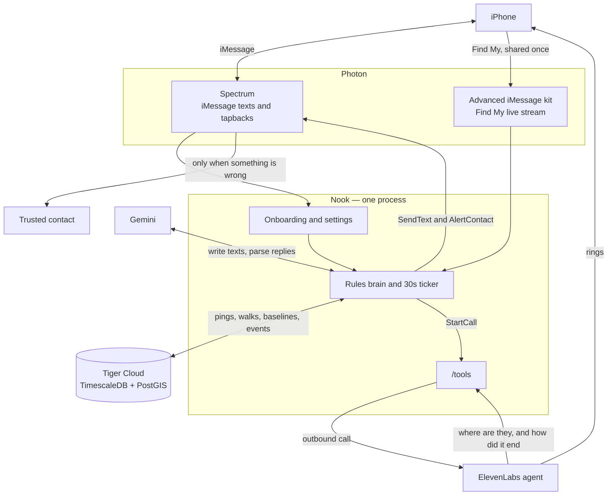

# Nook

Nook is an iMessage agent that walks you home at night. It learns what a normal trip looks like for you, texts only when something is off, and can call you in a real voice that knows where you are. Your trusted contact hears from Nook only when something is wrong. Nook never contacts the police.

## The problem

Getting home at night in a city is a safety problem that existing tools handle badly.

Sharing your location with a friend only helps if they are awake and watching. A generic safety app that pings on every pause trains you to ignore it, because a bodega stop and a real problem look the same to an app that does not know you. Calling 911, or texting a contact "are you home yet?" on every walk, is the wrong default for a trip that is usually fine.

What people actually need is a watcher that already lives in the thread they use, stays quiet on a normal walk, and escalates in the way *they* chose when the walk stops looking like theirs.

## What Nook does

You text Nook once. It walks you through setup in the same thread: your name, a trusted contact, when it should watch (only trips you start, evenings, or whenever you are away from home), and what to do if a check-in goes unanswered (call you, text your contact, both, or one last nudge). It asks you to share Find My, then asks if you are home so it can save that point.

After that:

- **It notices you heading out.** On a watched evening, a couple of minutes of walking away from home gets one text: "heading home?" A thumbs-up starts the walk. "Walk me home" starts one any time of day. Driving speed is ignored.
- **It stays quiet when the walk looks like yours.** A stop at a place you usually stop (the corner bodega, a friend's) is silent until you have been there longer than you usually are. A walk that ends at a friend's place closes quietly.
- **It checks in when the walk does not.** Standing still somewhere new, drifting off the cells you usually walk, running later than your typical trip, or the phone going silent all produce one short text. A thumbs-up or "i'm good" resumes the walk. Saying where you are ("at Sam's") saves that place so the next visit is expected.
- **Silence has a next step you picked.** One nudge, then the action from setup. The nudge tells you what that action is and when it happens. A safety floor always takes that step: an unanswered check-in, a location that stops updating, a "help" reply, or ‼️ / "call me". Your settings choose *which* action, and the floor always acts.
- **A call is a friend, not a recording.** ‼️, "call me", or an unanswered check-in (if you asked to be called) rings your phone. The voice knows your name, the street, and how long you have been walking. It can look up where you are right now, keep you company, or play along as a cover call. If you ask it to reach your contact, or the call ends without a clear "I'm okay", that person gets one text with your last location. Picking up is not the same as being safe.
- **Home is a text to you.** Two fixes near home close the walk: "home safe." Your contact is not told you arrived, and they are not told if you ended the night somewhere else on purpose.
- **You can change the deal by text.** "Settings" shows the summary. Changing your name, contact, monitoring window, escalation, or check-in timing is repeated back and saved only after you say yes.

Every decision on a location update is deterministic code. A model never sits on that path.

## How the pieces fit

One Bun process. Photon owns the phone. Tiger owns memory of past walks. The brain turns pings and texts into actions. Gemini writes and reads language. ElevenLabs is the voice that can ring you.



A walk, end to end:

1. Spectrum delivers the text or tapback. The router handles setup and settings itself. Anything else becomes an event for the brain.
2. The Find My watch emits a location ping. The brain stores it, then runs rules against a five-minute window and a walk plan loaded once from Tiger.
3. Find My only sends a point when the phone moves, so a 30-second ticker runs the time-based rules (no reply, no update, late, stopped) without waiting for the next ping.
4. The brain returns actions: text you, text your contact, or start a call. The messenger sends them in order.
5. A call goes out through the ElevenLabs agent, which rings the phone and calls back into `/tools/location` and `/tools/call-outcome`. Those outcomes re-enter the brain as events, so a pending "text my contact" step still fires if the call never reaches "I'm okay".

Phase is kept in memory and on the walk row, so a restart resumes an open walk from Tiger. The process is one instance on purpose: the ping window and the Find My stream cannot be split across replicas.

## Why each sponsor's stack is the product

### Photon — the product has to live in iMessage, on a live Find My stream

Nook is not an app you open on a dark street. The whole interaction is an iMessage thread: short texts, and tapbacks (👍 👎 ‼️ ❓) that mean "start", "not now", "I'm okay", and "call me". Those reactions only exist on Photon's cloud iMessage line. A local Messages client cannot host an agent, cannot match a tapback to the check-in it was reacting to, and cannot open a second thread to text a trusted contact who has never installed anything.

Location is a separate Photon surface, and it has to be. Find My updates are not messages. They are not on the durable log, they are not replayable, and they arrive only when the phone moves, with gaps, heartbeats, and optional coordinates. The Advanced iMessage kit is what sends the share card (`locations.request`) and then holds the live watch (`locations.watch`) with reconnect and sequence dedupe. The brain's timers exist because that stream is shaped this way. Without it, Nook would be a chatbot you have to remember to message, which is the failure mode the product is built to avoid.

### Tiger Cloud — personalization is a query, not a guess

"Unusual for you" has to be a number: how long this origin usually takes (median and 90th percentile), which cells you have walked on trips that ended at home, which stops you have visited at least twice and how long you stay. Those numbers are loaded once, when a walk starts, into a plan the rules read. They come from weeks of pings.

That history is a time series of points. Tiger Cloud is Postgres with TimescaleDB and PostGIS, which is the shape of the data:

- Every ping and every rule firing is a Timescale hypertable. The safety path inserts a row and moves on. It does not call a model, and it does not scan an unbounded log to decide the next text.
- Home, stops, and pings are PostGIS `geography` points, so "within 50 m of home", "150 m away", and "200 m off every usual cell" are real distances, not a lat/lon heuristic.
- `walk_baselines` and `known_stops` are SQL views over completed walks (percentile duration, dwell, visit counts). `presence_hourly` is a continuous aggregate that rolls pings into hourly presence. The rules read those views. They do not re-derive a person's routine on every ping.
- Walk phase lives in Tiger, so the always-on process can restart and pick the walk back up.

A model cannot be this memory. Putting an LLM on the ping path would make every location update a network call, and it would make "are you late?" a judgment call. Tiger is why the check-in can be personal and still be the same answer every time.

### Gemini — language in and out, never the safety decision

People do not text in keywords. "heading to sam's, all good" and "i think someone's following me" have to become `ok` (and a place to remember) or `help` (call, then the contact). The other direction matters too: the texts Nook sends should sound like a friend who knows this walk is usually twenty minutes with one stop, not a template that is identical for everyone.

Gemini does only those two jobs, and only off the location path. When a walk starts, it writes the prompt, check-in, nudge, and home texts from the plan Tiger just loaded. When a free-text reply arrives, it classifies it to JSON (`ok`, `help`, or `unclear`, plus a place label). Both calls are capped at a few seconds. If Gemini is slow, down, or returns junk, canned copy and a regex parser take over and the rules keep running.

That split is the point. The model is what lets Nook talk like a person. The rules are what decide that a missed check-in still escalates. Neither works as the whole system.

### ElevenLabs — the escalation has to be a conversation that can act

A missed text is not solved by a robocall that plays a message. The person may want a friend on the line so they can leave an uncomfortable moment, or they may need someone to reach their contact while they stay on the phone. That requires a voice that can listen, look up the live street, and report a structured outcome back.

The ElevenLabs agent is that voice, and it is what rings the phone. Nook starts the call with dynamic variables the model is not allowed to invent: who is calling, which walk, the last street, minutes walking, and the contact's name. Two webhook tools point back at this process. `get_location` reads the brain's live window. `report_call_outcome` returns `started`, `resolved_safe`, `request_escalation`, or `ended_unresolved`. Only `resolved_safe` cancels a pending contact text. Answering the phone does not.

The agent is also bounded on purpose: it can text the one saved contact by reporting an outcome, and it cannot call the police or anyone else. The safety policy stays in the brain. ElevenLabs is what makes the policy something you can talk to, on a real call, while the walk is still open.

## Run it

```bash
bun install
cp .env.example .env   # DATABASE_URL from Tiger Cloud, plus the keys for the services above
bun run db:migrate
bun run seed:user
bun run seed:history   # ~2 weeks of walks so personalization has a baseline
bun run typecheck
bun run start          # GET /health — BRAIN_MODE=stub|echo|live
```

`BRAIN_MODE=live` is the real rules brain and needs `DATABASE_URL`. `echo` replies without a database. `stub` logs events only. `PROVIDER=terminal` exercises the same brain without a phone. `PROVIDER=imessage` uses Photon cloud.

Simulator suites (no phone) and the contract for events, actions, and rules live in [CONTEXT.md](CONTEXT.md). Ownership and the layer checklist live in [TEAM.md](TEAM.md).
